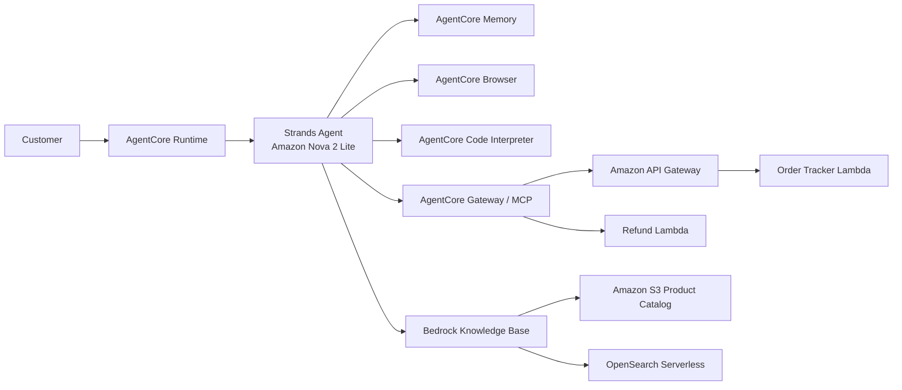

# Customer Support AI Agent with Amazon Bedrock AgentCore

## Overview

This project implements a production-style customer support AI agent using **Amazon Bedrock AgentCore**, **Strands Agents**, and AWS serverless services. The agent can track orders, process refunds, retrieve product/support information from a Bedrock Knowledge Base, calculate loyalty discounts with AgentCore Code Interpreter, remember customer preferences across sessions, and browse live web pages when needed.

The deployed agent uses **Amazon Nova 2 Lite** and combines multiple tools through one Strands agent workflow.

## Architecture



## Key Features

- **Order tracking through AgentCore Gateway**
  - Retrieve an order by order ID
  - Retrieve customer order history
  - Retrieve customer details
- **Refund processing through AgentCore Gateway**
  - Initiate refunds
  - Check refund status
  - Generate return labels
  - For full refunds, retrieve the order total first and then pass the verified amount to the refund tool
- **Retrieval-Augmented Generation (RAG)**
  - Amazon Bedrock Knowledge Base
  - S3-backed product/support content
  - OpenSearch Serverless vector store
- **Long-term memory**
  - Semantic facts
  - User preferences
  - Cross-session recall using the same customer/actor ID
- **Loyalty calculations**
  - Executed in AgentCore Code Interpreter
  - Point redemption in 500-point blocks
  - Point redemption capped at 50% of the original order value
  - Tier discount applied after point redemption
  - Points earned and remaining points calculated automatically
  - Tier-only fallback if Code Interpreter is unavailable
- **AgentCore Browser**
  - Live website navigation and content retrieval
- **Structured output validation**
  - Pydantic validation of Code Interpreter results
  - Required-field, type, and range validation
  - Validated `display_text` to keep final prose consistent with the tool result
  - Validated fallback output

## Standout Enhancement: Pydantic Validation

The loyalty calculator returns structured JSON from AgentCore Code Interpreter. Before the result is returned to the language model, it is validated with a Pydantic model.

Validated fields include:

```text
points_redeemed
points_discount
tier_discount_pct
tier_discount
total_savings
final_total
points_earned
remaining_points
display_text
fallback
```

Numeric fields use constraints such as non-negative values and a tier percentage from 0 to 100. The tool also generates `display_text` from the same validated calculation. The system prompt instructs the agent to preserve these validated values instead of performing its own loyalty arithmetic.

## Technology Stack

| Component | Technology |
|---|---|
| Agent framework | Strands Agents |
| Runtime | Amazon Bedrock AgentCore Runtime |
| Foundation model | Amazon Nova 2 Lite |
| Tool integration | AgentCore Gateway + MCP |
| Order API | Amazon API Gateway |
| Backend functions | AWS Lambda |
| Knowledge retrieval | Amazon Bedrock Knowledge Bases |
| Vector store | Amazon OpenSearch Serverless |
| Source storage | Amazon S3 |
| Long-term context | AgentCore Memory |
| Sandboxed computation | AgentCore Code Interpreter |
| Web navigation | AgentCore Browser |
| Structured validation | Pydantic |
| AWS SDK | boto3 |
| Package management | uv |

## Project Structure

```text
Project_starter/
├── main.py
├── pyproject.toml
├── requirements.txt
├── product_catalog.txt
├── lambda/
│   ├── order_tracker.py
│   ├── refund_processor.py
│   └── lambda_schema/
└── README.md
```

## AgentCore Resources

The implementation uses these logical resources:

- **Agent Runtime:** `customer_support_agent`
- **AgentCore Gateway:** `CustomerSupportGateway`
- **Memory:** `starter_mem`
- **Knowledge Base:** `CustomerSupportKB`
- **Order Lambda:** `order-tracker`
- **Refund Lambda:** `refund-processor`
- **API Gateway:** `CustomerSupportAPI`
- **Region:** `us-east-1`

Account-specific ARNs and temporary credentials are intentionally omitted from this README.

## Prerequisites

- AWS account or course lab environment with Bedrock AgentCore access
- Python 3.13 for Direct Code Deploy runtime
- `uv`
- AWS CLI configured with valid credentials
- Bedrock AgentCore CLI / Starter Toolkit used by the lab
- Access to Amazon Nova 2 Lite
- IAM permissions for Runtime, Gateway, Memory, Browser, Code Interpreter, and Knowledge Base retrieval

## Installation

Install dependencies:

```bash
uv sync
```

If dependencies change, export deployment requirements:

```bash
uv export \
  --format requirements-txt \
  --no-hashes \
  --no-dev \
  --no-emit-project \
  -o requirements.txt
```

## Configuration

Set the required resource values in `main.py`:

```python
GATEWAY_URL = "https://<gateway-id>.gateway.bedrock-agentcore.us-east-1.amazonaws.com/mcp"
KB_ID = "<knowledge-base-id>"
REGION = "us-east-1"
MEMORY_ID = "<memory-id>"
```

Model configuration:

```python
model_id = "global.amazon.nova-2-lite-v1:0"
```

Never commit AWS access keys, secret keys, or session tokens.

## Memory Design

The project uses two long-term memory types:

```text
SEMANTIC
cs_agent/{actorId}/facts

USER_PREFERENCE
cs_agent/{actorId}/preferences
```

Before processing a normal user message, relevant memories are retrieved and prepended as customer context. After the agent responds, the latest user query and assistant response are saved as a memory event.

Using the same `customer_id` with a different `session_id` allows preferences to be recalled across sessions.

## Knowledge Base Tool

The `search_knowledge_base` tool uses the Bedrock Agent Runtime `Retrieve` API for:

- Product specifications
- Warranty information
- Return and refund policies
- Loyalty program details
- Order status definitions

Retrieved chunks are joined and returned to the agent as grounded context.

## Loyalty Calculation Rules

### Point Earning

| Product category | Points per $1 |
|---|---:|
| Standard | 1 |
| Device | 2 |
| Fresh | 5 |

### Tier Discounts

| Tier | Discount |
|---|---:|
| Silver | 0% |
| Gold | 10% |
| Platinum | 15% |

### Redemption Rules

- 100 points = $1
- Redemption occurs in blocks of 500 points
- Point redemption cannot exceed 50% of the original order value
- Tier discount is applied **after** the points discount

### Example

For a Gold member with 4,250 points and a $150 standard-item order:

```text
Original order:        $150.00
Points redeemed:         4,000
Points discount:        $40.00
Subtotal:              $110.00
Gold discount (10%):    $11.00
Total savings:          $51.00
Final total:            $99.00
Points earned:              99
Remaining points:          349
```

The Code Interpreter result is validated with Pydantic before it is returned to the agent.

## Local Testing

Check syntax:

```bash
uv run python -m py_compile main.py
```

Example local invocation:

```bash
uv run python - <<'PY'
import asyncio
from main import invoke

payload = {
    "prompt": "Can you track order ORD-001?",
    "customer_id": "CUST-123",
    "session_id": "local-test"
}

loop = asyncio.new_event_loop()
asyncio.set_event_loop(loop)
result = loop.run_until_complete(invoke(payload))
print(result)
PY
```

The explicit event loop is useful for local Browser testing because Browser dependencies can modify asyncio behavior.

## Deployment

Configure the Runtime:

```bash
uv run agentcore configure \
  --entrypoint main.py \
  --name customer_support_agent \
  --region us-east-1 \
  --deployment-type direct_code_deploy \
  --runtime PYTHON_3_13 \
  --requirements-file requirements.txt
```

During configuration:

- Use IAM authorization
- Use public networking for this lab
- Select the existing AgentCore Memory resource
- Allow the CLI to use/create the deployment S3 bucket and Runtime execution role as permitted by the environment

Deploy:

```bash
uv run agentcore deploy
```

Check status:

```bash
uv run agentcore status
```

Expected status:

```text
Endpoint: DEFAULT (READY)
```

> **CLI note:** The course environment used the Bedrock AgentCore Starter Toolkit CLI. It may display a recommendation to migrate to the newer `@aws/agentcore` CLI. The commands above match the lab environment used for this implementation.

## Invoke the Deployed Agent

```bash
uv run agentcore invoke '{
  "prompt": "Can you track order ORD-001?",
  "customer_id": "CUST-123",
  "session_id": "deploy-test"
}'
```

## Verified Test Scenarios

| Test | Scenario | Verified Result |
|---|---|---|
| 1. Order tracking | Track `ORD-001` | `SHIPPED`, UPS, `TRK987654321` |
| 2. Refund processing | Full refund for Kindle Paperwhite on `ORD-002` | `$139.99`, `APPROVED`, refund ID returned |
| 3. Knowledge Base / RAG | Platinum loyalty benefits | Free same-day shipping, 15% discount, priority customer support |
| 4. Code Interpreter | Gold, 4,250 points, $150 standard order | $40 points discount, $11 tier discount, $99 final total, 349 remaining points |
| 5. Cross-session Memory | Save preferences in one session and recall in another | Both preferences recalled |
| 6. Browser | Open `https://example.com` and read heading | `Example Domain` |
| 7. Structured validation | Validate Code Interpreter output | Correct result with `fallback=false` |
| 8. Fallback validation | Force Code Interpreter failure | Validated tier-only result with `fallback=true` |

## Example Pydantic-Validated Result

Normal path:

```json
{
  "points_redeemed": 4000,
  "points_discount": 40.0,
  "tier_discount_pct": 10,
  "tier_discount": 11.0,
  "total_savings": 51.0,
  "final_total": 99.0,
  "points_earned": 99,
  "remaining_points": 349,
  "display_text": "Points redeemed: 4000 points. Points discount: $40.00. Tier discount: 10% applied to the subtotal after points redemption, equal to $11.00. Total savings: $51.00. Final total: $99.00. Points earned: 99. Remaining points: 349.",
  "fallback": false
}
```

Fallback path:

```json
{
  "points_redeemed": 0,
  "points_discount": 0.0,
  "tier_discount_pct": 10,
  "tier_discount": 15.0,
  "total_savings": 15.0,
  "final_total": 135.0,
  "points_earned": 0,
  "remaining_points": 4250,
  "fallback": true
}
```

The fallback intentionally computes only the tier discount because point redemption is delegated to Code Interpreter in the normal path.

## IAM Notes

The deployed AgentCore Runtime role needs access to all services used by the agent. Important permissions include:

- Bedrock model invocation
- AgentCore Gateway access
- AgentCore Memory
- `bedrock:Retrieve` for the Knowledge Base
- AgentCore Browser session/automation access
- AgentCore Code Interpreter access
- CloudWatch Logs as required by the Runtime

In restricted lab environments, observability/X-Ray setup can produce warnings even when the AgentCore Runtime deploys successfully.

## Reliability and Safety Measures

The system prompt instructs the agent to:

- Use tools as the source of truth
- Never invent order details, refund outcomes, policies, prices, or calculations
- Report tool authorization/retrieval failures instead of guessing
- Retrieve the order amount before initiating a full refund when the amount was not supplied
- Treat validated loyalty output as authoritative
- Avoid independently recalculating validated loyalty values
- Use the tool-generated `display_text` as the basis for the final loyalty response

## Challenges and Lessons Learned

### Runtime IAM vs. Local IAM

A tool can work locally but still fail after deployment. Local tests use developer/lab credentials, while the deployed agent uses a separate AgentCore Runtime execution role. The Knowledge Base and Browser worked locally but initially required additional permissions on the Runtime role.

### Multi-Tool Orchestration

For refunds, immediately calling the refund tool without retrieving the order first could produce an incorrect zero-value refund. The workflow was improved so it retrieves the order amount first and then calls the refund processor with the verified total.

### Structured Data Does Not Automatically Guarantee Grounded Prose

Pydantic validated the loyalty result correctly, but the language model could still introduce a different number while rewriting the result. A validated `display_text` field and stricter grounding instructions were added so the final response remains faithful to the validated calculation.

## Reflection

This project gave me practical experience building a customer support AI agent with Amazon Bedrock AgentCore and Strands Agents. One important implementation decision was to use AgentCore Gateway with MCPClient for order-tracking and refund tools. I chose this approach because it allowed the agent to access multiple backend services through a consistent tool interface instead of hard-coding direct service calls inside the agent. I also used AgentCore Code Interpreter for loyalty calculations and added Pydantic validation so the structured calculation result could be checked before it was returned to the language model.

A concrete challenge I encountered was that some features worked locally but failed after deployment because the AgentCore Runtime used a different IAM execution role. For example, Knowledge Base retrieval and Browser access initially returned authorization errors. I resolved this by reviewing the runtime role, adding the required permissions, redeploying, and then retesting each integration separately. I also improved Gateway error handling so connection failures, timeouts, or empty tool lists are logged with meaningful messages instead of causing silent failures.

For production use, security, monitoring, and cost control would be important. I would apply least-privilege IAM policies so the runtime can access only the specific Knowledge Base, Gateway, Browser, and other resources it needs. I would also use CloudWatch logs and alerts to monitor tool failures, latency, and repeated authorization errors. Cost should also be monitored, especially for services such as OpenSearch Serverless, because persistent infrastructure can continue generating charges even when the agent is not actively used. In production, I would add budgets, resource cleanup procedures, and automated monitoring to control unnecessary spending while keeping the system reliable.
